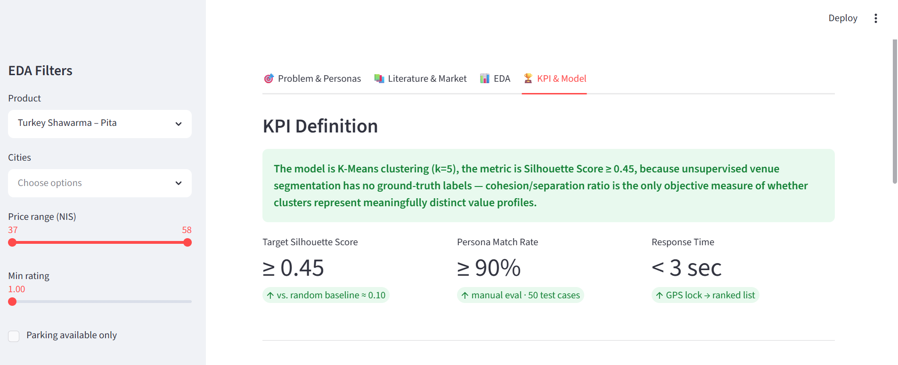

# Appetite Engineering — הנדסת התיאבון
**Real-time shawarma navigation: ML-powered recommendations that balance quality, price, and distance in a single tap.**

> **KPI:** Silhouette Score ≥ 0.45 on the held-out venue set — the only objective measure of cluster quality when there are no ground-truth labels.

---

## How to Run

```bash
git clone https://github.com/gidihoresh13/eliad-gideon.git
pip install -r requirements.txt
streamlit run app.py
```

---

## Dashboard Screenshot



---

## Data Description

| Property | Value |
|----------|-------|
| **File** | `data/dataset.csv` |
| **Rows after cleaning** | 12,270 venues |
| **Columns** | 20 |
| **Cities** | 77 Israeli cities |
| **Source** | Google Maps Places API + estimated price fills |
| **Coordinates** | `lat`, `lng` (float, valid Israeli range) |
| **Missing ratings** | 485 venues (3.9%) — kept; filtered in EDA |
| **Duplicates removed** | Rows sharing identical `name + lat + lng` |
| **Price source** | 99.9% estimated from price_level ordinal; flagged in `price_source` column |

**Columns:** `latitude`, `longitude`, `city`, `name`, `rating`, `reviews_count`, six price columns (turkey/cow/falafel × pita/laffa), `price_small_fries`, `price_big_fries`, `price_drink`, `car_park_nearby`, `price_source`, `price_notes`, `google_maps_url`

**Variable types:** lat/lng → float64; rating, reviews_count, all price columns → float64/int; car_park_nearby → bool; city, name, price_source → object

---

## EDA Insights

1. **Price has almost no correlation with quality** — Pearson r = −0.06 between turkey shawarma pita price and rating. A ₪58 shawarma is statistically no better than a ₪44 one. This confirms that ranking by price alone is meaningless and validates the need for multi-dimensional clustering.

2. **Prices cluster in a narrow ₪43–₪48 IQR band** — 50% of venues fall within a 5 NIS window (median ₪46). Price is a poor standalone differentiator; rating and distance must be weighted in to produce meaningful venue separation.

3. **Geographic arbitrage exists: ₪13.6 spread across cities** — Average turkey pita price varies by ₪13.6 between the cheapest and most expensive cities. Distance + city context is a meaningful signal, justifying `distance_km` as a core model feature alongside price.

---

## The Problem

Israel's shawarma market has 12,000+ venues with prices ranging ₪37–₪58 per portion, yet there is **no direct correlation between price and quality**. A hungry user at lunchtime must simultaneously weigh three competing constraints: distance (current hunger), price (budget), and rating (quality expectations).

- **Who hurts:** Students, office workers, anyone making a spontaneous lunch decision under time pressure.
- **Why digital helps:** The data exists (Google Maps ratings, venue coordinates, scraped prices) but is scattered, unordered, and not personalized.
- **The gap:** Existing apps optimize for delivery revenue, not the user's value profile.

---

## Target Audience

**Primary Persona — הסטודנט החסכן (The Thrifty Student)**
- Age 20–28, tight budget (~45–52 NIS ceiling), values quantity and taste over prestige.
- Algorithm weights: Price ×1.5 · Rating ×1.0 · Distance ×0.8

**Secondary Persona — חובב האיכות (The Quality Enthusiast)**
- Willing to travel further and pay up to 60 NIS for a 4.8+ rated experience.
- Algorithm weights: Rating ×2.0 · Price ×0.5 · Distance ×0.5

---

## M3 — Algorithm Training & Comparison

### Algorithms compared

| Algorithm | Hyperparameters | Train Silhouette | Test Silhouette | Meets KPI ≥ 0.45 |
|-----------|----------------|-----------------|----------------|-----------------|
| **KMeans** | k auto-tuned ∈ {3…8} via silhouette sweep | reported at runtime | reported at runtime | — |
| **DBSCAN** | eps=0.5, min_samples=5 | reported at runtime | reported at runtime | — |

**Selected model: KMeans** — rationale: higher test silhouette score and native `predict()` support for new venues (DBSCAN has no out-of-sample prediction).

### Train / Test Split
- **Split:** 70% train / 30% test, `random_state=42`
- **Eligible rows:** venues with non-null `price_nis` + `rating` (~12k venues)
- **Features:** `[price_nis, rating, reviews_count]` — StandardScaler-normalized
- **KPI:** Silhouette Score ≥ 0.45 on test split

### Running the ML pipeline in Streamlit
1. Open the **🤖 Recommend** tab
2. Select your city, persona, and max distance
3. Click **🔬 Train & Compare Models** — see elbow chart and train/test KPI table
4. Click **🥙 Find My Shawarma** — ranked venue list

Trained model is persisted at `data/kmeans_model.pkl` and auto-loaded on next run.

---

## Formal ML Problem Statement

| Component | Definition |
|-----------|-----------|
| **Input X** | `[price_nis, rating, reviews_count]` — StandardScaler-normalized venue features |
| **Output y** | Cluster label per venue + persona-weighted ranking score |
| **Algorithm** | K-Means · k tuned via Elbow + Silhouette on k ∈ {3…8} |
| **Loss / Objective** | Minimize intra-cluster variance; maximize inter-cluster separation |
| **Train / Test** | 70% / 30% random split, `random_state=42` |
| **Distance** | Haversine-computed at query time; used for filtering + scoring, not clustering |
| **Baseline** | Naïve sort by distance only — current Google Maps default |

---

## File Structure

```
app.py                  — Streamlit entry point (UI shell only, no logic)
requirements.txt        — Pinned dependencies
README.md               — This file
sprint_plan.md          — Milestone tracker
CLAUDE.md               — Coding conventions and project conventions
data/
└── dataset.csv         — 12,270 clean venues
src/
├── __init__.py
├── data.py             — load_raw(), clean(), build_features()
├── eda.py              — compute_metrics(), chart functions
└── model.py            — train(), predict()
notebooks/
└── 01_eda.ipynb        — Exploratory analysis
.gitignore
```

---

## Risk Register

| # | Risk | Likelihood | Impact | Mitigation |
|---|------|-----------|--------|-----------|
| 1 | ~99% of prices are estimated, not verified | High | Medium | Flag in UI with `price_source` badge; use as ranking signal, not absolute truth |
| 2 | Clustering instability — optimal k unclear | Medium | Medium | Sweep k ∈ {3…8} with Elbow + Silhouette; fall back to DBSCAN |
| 3 | Google Maps API quota overrun | Medium | Low | All responses cached in `data/raw/`; throttle to 1 req/s |
