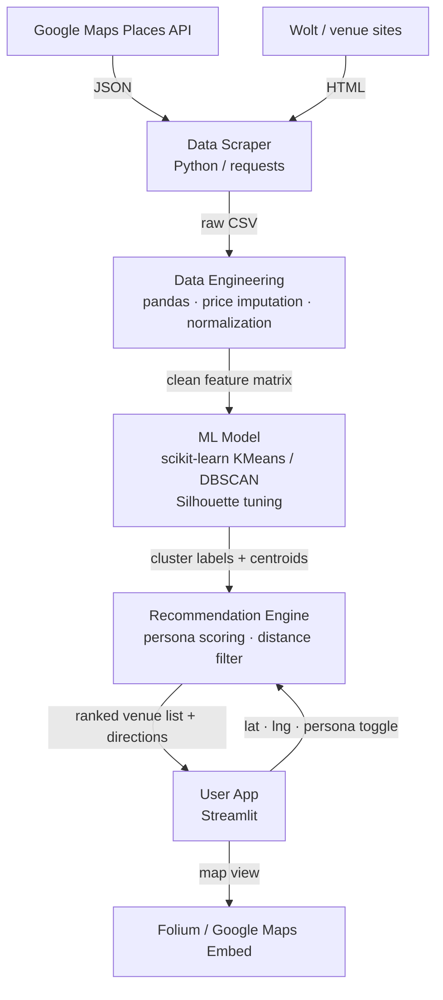

# Appetite Engineering — הנדסת התיאבון
**Real-time shawarma navigation: ML-powered recommendations that balance quality, price, and distance in a single tap.**

> **KPI:** The model is K-Means clustering (k=5), the metric is Silhouette Score ≥ 0.45, because unsupervised venue segmentation has no ground-truth labels — cohesion/separation ratio is the only objective measure of whether clusters represent meaningfully distinct value profiles.

---

## One-Liner

> סטודנטים ואנשים רעבים בשעות הצהריים סובלים מעומס קוגניטיבי בבחירת מסעדת שווארמה, ואנחנו נבנה אפליקציית ניווט והמלצות שמשתמשת בנתוני Google Maps, מחירים ודירוגים יחד עם מודל Clustering כדי להתאים את הפסקה המושלמת לכל משתמש בזמן אמת.

---

## The Problem

Israel's shawarma market contains hundreds of venues with prices ranging from 40–60 NIS per portion, yet there is **no direct correlation between price and quality**. A hungry user at lunchtime must simultaneously weigh three competing constraints: distance (current hunger), price (budget), and rating (quality expectations). This cognitive triangle is the core friction:

- **Who hurts:** Students, office workers, and anyone making a spontaneous lunch decision under time pressure.
- **Why digital helps:** The data exists (Google Maps ratings, venue coordinates, scraped prices) but is scattered, unordered, and not personalized — a model can fuse it instantly.
- **The gap today:** Existing apps (Wolt, Ten Bis) optimize for delivery revenue, not for the user's value profile. A search for "shawarma near me" returns a flat, context-free list that ignores the user's price sensitivity and quality threshold.
- **Consequence without a solution:** Users routinely overpay (up to 7 NIS more) for objectively worse shawarma, or miss a 5-star spot two streets away, purely due to information asymmetry.

---

## Target Audience

**Primary Persona — הסטודנט החסכן (The Thrifty Student)**
- Age 20–28, university campus or urban area, tight budget (~45–55 NIS ceiling), values quantity and taste over prestige.
- **Use Case:** It's 13:10, between lectures. Eyal opens the app, his location is detected automatically, and within 5 seconds he sees the nearest shawarma rated ≥ 4.0 stars under 50 NIS — with walking directions and an estimated wait. He reaches it in 7 minutes, pays 47 NIS, and makes it back before the next lecture.

**Secondary Persona — חובב האיכות (The Quality Enthusiast)**
- Willing to travel further and pay up to 60 NIS for a 4.8+ rated experience; price is secondary to the perfect bite.

---

## Data Source & Data Card

**Primary source:** Google Maps Places API — shawarma venues across Israel (Tel Aviv metro area for v1).

| Field | Details |
|-------|---------|
| **Dataset size** | ~800 venues scraped (Tel Aviv + surrounding cities); expandable nationwide |
| **Format** | JSON → normalized to CSV / Pandas DataFrame |
| **License** | Google Maps Platform ToS — data used for non-commercial academic project; no redistribution of raw API responses |
| **Key fields** | `place_id`, `name`, `lat`, `lng`, `rating` (1.0–5.0), `user_ratings_total`, `price_level` (0–4), `address` |
| **Supplementary scrape** | Menu prices (NIS per shawarma portion) scraped from venue websites / Wolt listings where available |
| **Known gaps** | `price_level` from Google is ordinal (0–4), not actual NIS — ~35% of venues are missing exact prices and require imputation or manual scraping |
| **Possible biases** | Tourist-trap venues near landmarks are over-reviewed; peripheral neighborhood spots are under-reviewed (fewer ratings → noisier signal). Ratings are cumulative and may not reflect current quality post-ownership changes. |

---

## Formal ML Problem Statement

| Component | Definition |
|-----------|-----------|
| **Input X** | Feature vector per venue: `[price_NIS, rating, distance_km, ratings_count]` |
| **Output y** | Cluster assignment (unsupervised) + ranked recommendation score per user persona |
| **Algorithm** | K-Means / DBSCAN clustering to segment venues into value profiles (e.g., "hidden gem", "tourist trap", "budget pick", "premium") |
| **Loss / Objective** | Minimize intra-cluster variance; maximize inter-cluster separation |
| **Success metric** | **Silhouette Score ≥ 0.45** on the held-out venue set; downstream: user-facing persona match rate ≥ 90% (manual evaluation on 50 test cases) |
| **Train / Val / Test split** | 70% train (cluster fitting) / 15% val (hyperparameter k selection) / 15% test (final Silhouette + manual spot-check) |
| **Baseline** | Naïve nearest-neighbor sort by distance only (no quality or price weighting) — current Google Maps default behavior |

---

## Technical Architecture



**Components & Libraries**

| Layer | Tech |
|-------|------|
| Scraping | `requests`, `googlemaps` Python SDK |
| Data processing | `pandas`, `scikit-learn` (`StandardScaler`, `KMeans`, `DBSCAN`) |
| Model evaluation | `sklearn.metrics.silhouette_score` |
| UI | `streamlit`, `folium` for map rendering |
| Input schema | `{lat: float, lng: float, persona: "student" \| "quality", max_dist_km: float}` |
| Output schema | `[{name, rating, price_nis, distance_km, cluster, score, maps_url}]` |

---

## User Stories

**1. Real-time nearby recommendation**
> As a hungry student between lectures, I want the app to show me the best-value shawarma within 1 km of my location, so that I can eat well without blowing my budget or wasting time searching.

*Acceptance criterion:* Given GPS location and "student" persona, the app returns a ranked list of ≥ 3 venues within 1 km in under 3 seconds, each showing price, rating, and walking distance.

---

**2. Persona switching**
> As a quality enthusiast treating a friend, I want to switch my profile to "quality mode", so that the algorithm re-ranks results to prioritize 4.8+ rated venues even if they cost more or are farther away.

*Acceptance criterion:* Toggling persona from "student" to "quality" changes the top recommendation without a page reload, and the new top result has a rating ≥ 4.8.

---

**3. Transparent scoring**
> As a skeptical user, I want to see why a venue was recommended (price, rating, distance breakdown), so that I can trust the suggestion rather than feel manipulated.

*Acceptance criterion:* Each result card displays the three component scores (value, quality, proximity) as a mini bar chart or labeled tags.

---

## Related Work

| Reference | Relevance | Our Differentiation |
|-----------|-----------|---------------------|
| **Yelp dataset challenges** (Asghar 2016, *arXiv:1605.05362*) — collaborative filtering on restaurant reviews | Demonstrates rating-based recommendation pipelines | We add real-time geolocation and explicit price signals; no collaborative filtering cold-start problem |
| **Google Maps "Popular Times" & Place Recommendations** | Industry baseline; optimizes for engagement, not user value | We optimize for the user's persona (budget / quality), not platform revenue |
| **Wolt / Ten Bis discovery feeds** | Local food delivery incumbents with ML-ranked listings | They filter by delivery availability and commission; we target walk-in, price-transparent shawarma specifically |

---

## Risk Register

| # | Risk | Likelihood | Impact | Mitigation |
|---|------|-----------|--------|-----------|
| 1 | **Data gap — missing exact prices** (~35% of venues lack NIS price) | High | High | Impute from `price_level` ordinal using median NIS per level from scraped subset; flag imputed venues in UI |
| 2 | **Clustering instability** — optimal k unclear for a small, dense urban dataset | Medium | Medium | Evaluate k ∈ {3…8} using Elbow + Silhouette; fall back to DBSCAN if spherical clusters don't hold |
| 3 | **Google Maps API quota / cost overrun** during scraping phase | Medium | Low | Cache all API responses locally; run scrapes in off-peak hours; stay within free-tier limits (~$200/month credit) for academic use |

---

## Installation

```bash
pip install -r requirements.txt
streamlit run app.py
```
