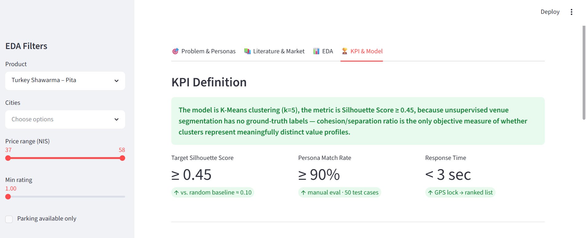

# Appetite Engineering — הנדסת התיאבון
**Real-time shawarma navigation: ML-powered recommendations that balance quality, price, and distance in a single tap.**

🔗 **Live demo:** https://eliad-gideon-mtdncgta6rxpxbrig6dtjx.streamlit.app/

> **KPI:** Silhouette Score ≥ 0.45 on the held-out venue set — the only objective measure of cluster quality when there are no ground-truth labels.

---

## How to Run

```bash
git clone https://github.com/gidihoresh13/eliad-gideon.git
pip install -r requirements.txt
streamlit run app.py
```

**Optional — enable the M4 agent (free-text recommendations):** add a free [Groq](https://console.groq.com) key so the 🤖 Agent tab can run the LLM. Copy the template and drop your key in:

```bash
cp .streamlit/secrets.toml.example .streamlit/secrets.toml
# then edit .streamlit/secrets.toml → GROQ_API_KEY = "gsk_..."
```

`.streamlit/secrets.toml` is git-ignored and must never be committed. Without a key the Agent tab still works via the city fallback (best / cheapest / closest).

---

## Dashboard Screenshot



---

## Data Description

| Property | Value |
|----------|-------|
| **File** | `data/dataset.csv` |
| **Rows after cleaning** | 774 venues |
| **Columns** | 19 (raw) |
| **Cities** | 143 Israeli cities |
| **Source** | Google Maps Places API + estimated price fills |
| **Coordinates** | `lat`, `lng` (float, valid Israeli range) |
| **Missing ratings** | 58 venues (7.5%) — kept; filtered in EDA |
| **Missing review counts** | 100% (`reviews_count` is currently empty for every venue) |
| **Duplicates removed** | Rows sharing identical `name + lat + lng` |
| **Price source** | 99.9% estimated, not scraped from menus; flagged in `price_source` column |

**Columns:** `latitude`, `longitude`, `city`, `name`, `rating`, `reviews_count`, four shawarma price columns (turkey/cow × pita/laffa) + `price_falafel_pita`, `price_falafel_laffa`, `price_small_fries`, `price_big_fries`, `price_drink`, `car_park_nearby`, `price_source`, `price_notes`, `google_maps_url`

**Variable types:** lat/lng → float64; rating, reviews_count, all price columns → float64/int; car_park_nearby → bool; city, name, price_source → object

`price_nis` (the model's price feature) is derived in `src/data.py` as the row-wise mean of the 4 shawarma price columns (turkey/cow × pita/laffa) — not just turkey-pita alone.

---

## EDA Insights

1. **Price has almost no correlation with quality** — Pearson r ≈ −0.15 between `price_nis` and rating. A pricier shawarma is statistically no better than a cheaper one. This confirms that ranking by price alone is meaningless and validates the need for multi-dimensional clustering.

2. **Prices cluster in a narrow ₪54–₪58 IQR band** — 50% of venues fall within a ~4 NIS window (median ₪56). Price is a poor standalone differentiator; rating and distance must be weighted in to produce meaningful venue separation.

3. **Geographic arbitrage exists: ~₪19.75 spread across cities** — Average shawarma price varies by ~₪19.75 between the cheapest and most expensive cities. Distance + city context is a meaningful signal, justifying `distance_km` as a core model feature alongside price.

4. **`reviews_count` is currently 100% missing** — every venue has 0 recorded reviews. This means the Bayesian-smoothed `weighted_rating` column collapses to a single constant (no variance at all), so it can't be used as a clustering feature; the model clusters on **raw `rating`** instead, which does carry real signal (std ≈ 0.69, range 1.0–5.0). `weighted_rating` is still computed and shown for reference in the EDA/Cluster Analysis tabs.

---

## The Problem

Israel's shawarma market has hundreds of venues with prices ranging ~₪49–₪69 per portion, yet there is **no direct correlation between price and quality**. A hungry user at lunchtime must simultaneously weigh three competing constraints: distance (current hunger), price (budget), and rating (quality expectations).

- **Who hurts:** Students, office workers, anyone making a spontaneous lunch decision under time pressure.
- **Why digital helps:** The data exists (Google Maps ratings, venue coordinates, scraped prices) but is scattered, unordered, and not personalized.
- **The gap:** Existing apps optimize for delivery revenue, not the user's value profile.

---

## Target Audience

**Primary Persona — הסטודנט החסכן (The Thrifty Student)**
- Age 20–28, tight budget (~₪55–60 ceiling), values quantity and taste over prestige.
- Algorithm weights: Price ×1.5 · Rating ×1.0 · Distance ×0.8

**Secondary Persona — חובב האיכות (The Quality Enthusiast)**
- Willing to travel further and pay up to ~₪70 for a 4.8+ rated experience.
- Algorithm weights: Rating ×2.0 · Price ×0.5 · Distance ×0.5

---

## M3 — Algorithm Training & Comparison

### Algorithms compared

| Algorithm | Paradigm | Hyperparameters | Train Silhouette | Test Silhouette | Meets KPI ≥ 0.45 |
|-----------|----------|----------------|-----------------|----------------|-----------------|
| **KMeans** | Partitional | k=9 (fixed — one per target class) | ~0.59 | ~0.58 | ✅ |
| **DBSCAN** | Density-based | eps auto-tuned, min_samples=5 | ~1.00 | ~0.68 | ✅ |
| **Agglomerative** | Hierarchical | k=9 (ward linkage) | ~0.57 | ~0.57 | ✅ |

**Selected model: KMeans (k=9)** — the only algorithm with native `predict()` for new venues. DBSCAN's silhouette is inflated (computed on non-noise points only) and it cannot generalize out-of-sample without a KNN fallback, so KMeans wins on deployability. *(Benchmark numbers in the table above predate the current dataset/feature swap — re-run **Train & Compare** for current figures.)* k is fixed at 9 so each cluster maps to one target class — {good / average / bad} × {expensive / reasonable / affordable} — enabling a confusion-matrix accuracy readout via Hungarian matching, which is always a fixed 9×9 (using the full class list, not just classes observed in a given split).

### Train / Test Split
- **Split:** 80% train / 20% test, `random_state=42`
- **Eligible rows:** venues with non-null `price_nis` + `rating` (716 of 774 venues)
- **Features:** `[price_nis, rating]` — StandardScaler-normalized. Raw `rating` is used (not the Bayesian-smoothed `weighted_rating`) because `reviews_count` is currently 100% missing, which would otherwise collapse `weighted_rating` to a constant with zero variance.
- **Target class thresholds:** rating good ≥ 4.5, average 4.0–4.4, bad < 4.0. Price expensive > ₪60, reasonable ₪54–60, affordable < ₪54.
- **KPI:** Silhouette Score ≥ 0.45 on test split + 9-class confusion-matrix accuracy

### Running the ML pipeline in Streamlit
1. Open the **🔮 Predicted** tab
2. Click **🔬 Train & Compare Models** — see the train/test KPI table, confusion matrix, and per-cluster deep-dive
3. The trained model is persisted at `data/kmeans_model.pkl` and auto-loaded on next run

---

## M4 — Agent Layer (free-text → model)

The agent **wraps** the M3 model — it translates language, the model produces the numbers. Loop:

1. **Free text in** — in the **🤖 Agent** tab you describe yourself in your own words (Hebrew or English), e.g. *"אני סטודנט בן 23 בחיפה, תקציב עד 60 ש"ח, רוצה את האיכות הכי גבוהה"*.
2. **LLM extracts 4 parameters** — a Groq/Llama model (`llama-3.3-70b-versatile`, `temperature=0`) returns strict JSON: `city` (מיקום) · `max_budget_nis` (סכום) · `quality_preference` (איכות) · `user_type` (סוג משתמש). If not stated, budget is inferred from life status (student≈58, working≈68, retired≈62, else 78). Invalid output (bad JSON / out of range / unknown city) → **fallback**: ask only for the city and return **best / cheapest / closest**.
3. **Your model selects** — `recommend()` builds the user's *ideal venue* from real data quantiles and calls `model.predict()` on it; the cluster the model assigns becomes the target, and the agent returns real venues the model placed in that same cluster. Persona weights only **order within** the model-chosen cluster. → **top 5**.
4. **LLM phrases the model's output** — `phrase_response()` (`temperature=0.3`) is handed the exact venues the model picked and restates them in the user's language; it cannot invent, add, drop, or change a venue/price/rating. Shown as a chat reply above the table.
5. **Map view** — the top 5 venues are also plotted on an interactive map (colored by model cluster, hover for name/price/rating) right below the results table.

Implemented in `src/agent.py`. The LLM translates **input and output**; the venues and numbers always come from your model. Groq is **OpenAI-compatible** (`chat.completions.create`). The key is read from `st.secrets["GROQ_API_KEY"]` (see *How to Run*).

---

## Formal ML Problem Statement

| Component | Definition |
|-----------|-----------|
| **Input X** | `[price_nis, rating]` — StandardScaler-normalized venue features |
| **Output y** | 9-class label: {good / average / bad} × {expensive / reasonable / affordable}; plus persona-weighted ranking score |
| **Algorithm** | K-Means · k = 9 (fixed — one cluster per target class) |
| **Loss / Objective** | Minimize intra-cluster variance; maximize inter-cluster separation |
| **Train / Test** | 80% / 20% random split, `random_state=42` |
| **Distance** | Haversine-computed at query time; used for filtering + scoring, not clustering |
| **Baseline** | Random cluster assignment (same k = 9), computed per run |

---

## File Structure

```
app.py                      — Streamlit entry point (6 tabs; UI shell only, no logic)
requirements.txt            — Pinned dependencies
README.md                   — This file
sprint_plan.md              — Milestone tracker
CLAUDE.md                   — Coding conventions and project context
.streamlit/
├── secrets.toml            — GROQ_API_KEY (git-ignored; never commit)
└── secrets.toml.example    — Template (committed)
data/
├── dataset.csv             — 774 clean venues (committed)
└── kmeans_model.pkl        — Trained KMeans model (auto-loaded by app)
src/
├── __init__.py
├── data.py                 — load_raw(), clean() [adds price_nis (mean of 4 shawarma
│                             price columns), weighted_rating], build_features()
├── eda.py                  — EDA chart functions
├── model.py                — split_data(), find_best_k(), train_kmeans(),
│                             train_dbscan(), train_agglomerative(), compare_algorithms(),
│                             compute_confusion_matrix() [always a fixed 9x9],
│                             assign_cluster_labels(), save_model(), load_model(), predict()
└── agent.py                — M4 agent: build_system_prompt(), build_user_prompt(),
                              extract_params() [Groq LLM], validate_params(),
                              recommend() [model picks cluster → top-5, plotted on a map],
                              fallback_recommend(), phrase_response() [LLM restates the model's picks]
tests/
└── test_core.py            — core tests (all must pass on every commit)
notebooks/
└── 01_eda.ipynb            — Exploratory analysis
.gitignore
```

**Tabs:** 🎯 Problem & Personas · 📚 Literature & Market · 📊 EDA · 🏆 KPI & Model · 🔮 Predicted · 🤖 Agent

---

## Risk Register

| # | Risk | Likelihood | Impact | Mitigation |
|---|------|-----------|--------|-----------|
| 1 | ~99% of prices are estimated, not verified | High | Medium | Flag in UI with `price_source` badge; use as ranking signal, not absolute truth |
| 2 | Clustering instability — optimal k unclear | Medium | Medium | Sweep k ∈ {3…8} with Elbow + Silhouette; fall back to DBSCAN |
| 3 | Google Maps API quota overrun | Medium | Low | All responses cached in `data/raw/`; throttle to 1 req/s |
